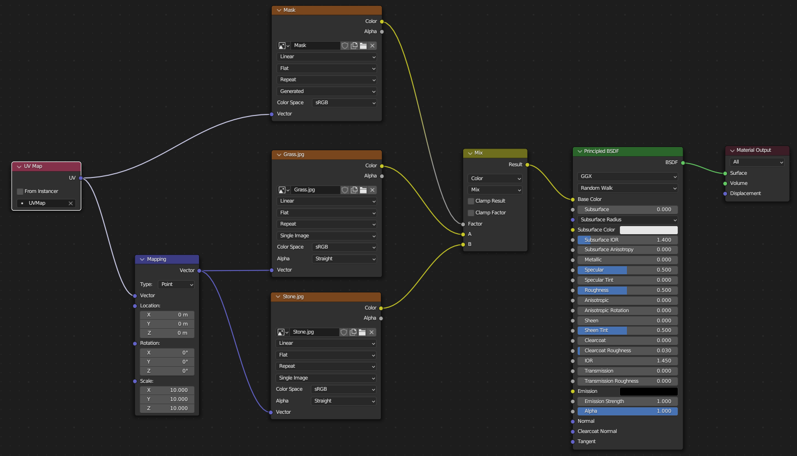
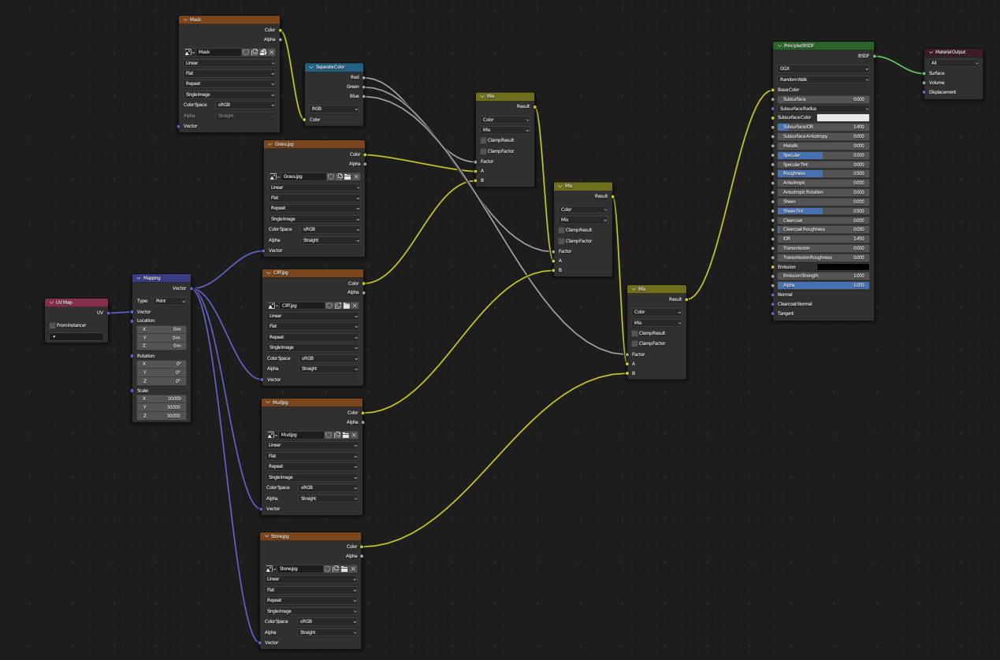
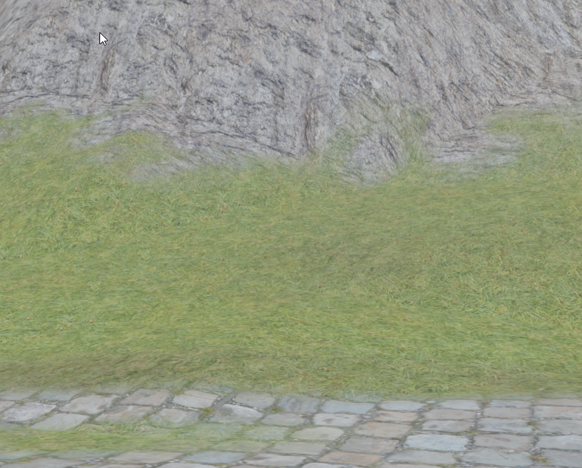

# Texture Splatting (Mask per Texture)

1. Create a plane with size 10 x 10
2. Apply scale (CTRL + A > Scale)
3. Switch to edit mode (TAB), Select all faces (A) and unwrap object (U > Unwrap)
4. Create a new material and add the following structure in Shading Editor
    1. `Grass` and `Stone` are textures. `Mask` is a new created texture with a size of 1024 x 1024

    
5. Select Mask-Node
6. Switch to Texture Paint Editor
7. Paint your texture

# Texture Splatting (RGBA Mask)

1. Create a plane with size 10 x 10
2. Apply scale (CTRL + A > Scale)
3. Switch to edit mode (TAB), Select all faces (A) and unwrap object (U > Unwrap)
4. Create a new material and add the following structure in Shading Editor
    1. `Grass`, `Stone`, `Mud`, `Cliff` are textures. `Mask` is a new created texture with a size of 1024 x 1024

    
5. Select Mask-Node
6. Switch to Texture Paint Editor
7. Paint your texture (Black, Red, Blue, Green)

## Result

